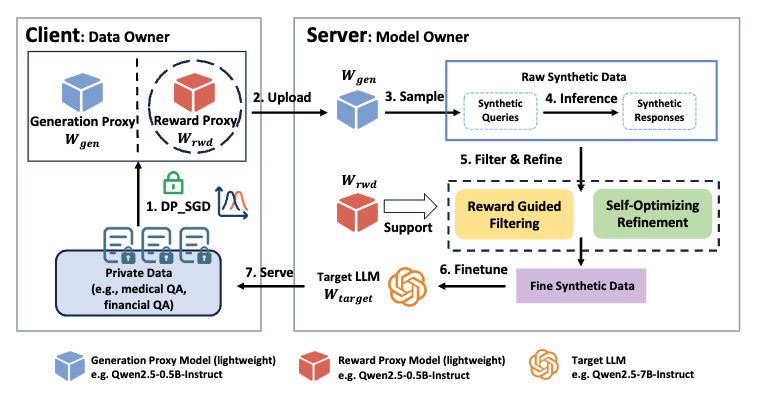

# RewardDS: Privacy-Preserving Fine-Tuning for Large Language Models via Reward Driven Data Synthesis

Source code for EMNLP2025 paper titled "[RewardDS: Privacy-Preserving Fine-Tuning for Large Language Models via Reward Driven Data Synthesis](https://arxiv.org/abs/2502.18517)".


<div align="center">
  

  **Figure 1:** The overview of our RewardDS framework. The client uses DP-SGD to fine-tune two lightweight proxy
models on privacy-sensitive data: the Generation Proxy Model and the Reward Proxy Model. 
The **Generation Proxy Model** is used to sample raw synthetic data, consisting of
queries and responses. 
The **Reward Proxy Model** supports the Reward Guided Filtering and Self-Optimizing
Refinement modules.
</div>

- We propose *RewardDS*, a novel privacy-preserving fine-tuning framework that improves the quality of synthetic data by training a Reward Proxy Model on the client side to guide synthetic data generation.

- We introduce the Reward Guided Filtering and Self-Optimizing Refinement modules to filter and refine the synthetic data, thereby enhancing its quality.

- We conducted extensive experiments across Medical QA, Legal QA, and Code Generation tasks to validate the effectiveness of our proposed framework.


## Brief Instructions

### Install

#### Clone and Install

```bash
git clone https://github.com/wjw136/RewardDS

conda create env -n rewardds
conda activate rewardds
pip install -r requirement.txt
```

### Usage

Here we provide the implementation of *RewardDS* for the Medical QA, Financial QA and Code Generation QA task.

The usage of our codebase are shown as the followed:

- **Go to the corresponding codebase subdir according to your task.**

``` bash
cd Medical_QA # For Medical QA task
cd Financial_QA # For Financial QA task
cd Code_Generation # For Code Generation task
```

- **Run our provided bash script.**
The detailed usage of these bash script has been provide in the new Readme.md file in the subdir.
Corresponding dataset path is 
```json
{
    "Medical_QA": "RewardDS_Dataset/Medical_QA",
    "Financial_QA": "RewardDS_Dataset/Financial_QA",
    "Code_Generation": "RewardDS_Dataset/Code_Generation"
}
```